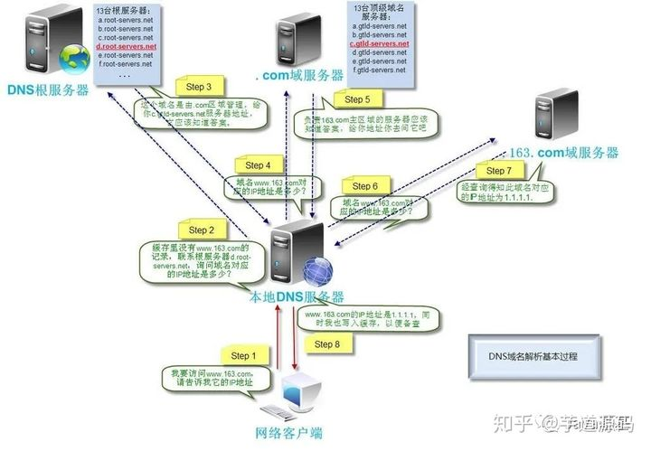

# 计算机网络

## 1.OSI七层模型和五层模型
### 七层模型：物理层、数据链路层、网络层、传输层、会话层、表示层、应用层
- **物理层**：计算机节点直接透明的比特流传输。尽可能屏蔽掉传输介质和物理设备直接的差异，使上层不必关心不同的传输介质带来的差异。主要目的是确定与传输媒体的接口一些特性。
- **数据链路层**：两台主机之间的数据传输，总是在一段段的链路上传送，这需要特点的链路层协议。将网络层交付的IP数据包组装成帧，在两个节点直接传输帧。每一帧包含数据和必要的控制信息，控制信息包括每一帧的起止比特位。此外也检查每一帧是否有差错，如果有则丢弃
- **网络层**： 选择两台主机直接的路由和交换节点。保证数据按时成功传送。在发送数据时，网络层包传输层报文或用户数据报封装成分组，并传输给数据链路层。在网络层使用的协议是无连接的网际协议（Internet Protocol）和许多路由协议，因此我们通常把该层简单地称为 IP 层。
- **传输层**：这一层是包括了TCP和UDP，是比较重要的。其任务是为两台主机之间提供通信服务。应用层利用该服务传输应用层数据报文，并不针对某一种应用协议，多个应用可以使用同一个传输层服务。由于一台主机可以由多个线程，传输层也会被复用和分用。所谓复用就是指多个应用层进程可同时使用下面传输层的服务，分用和复用相反，是传输层把收到的信息分别交付上面应用层中的相应进程。
- **会话层**：负责建立、管理和中止表示层实体至今的通信。该层提供了数据交换的界定和同步功能。包括建立检查点和恢复方法方案。
- **表示层**： 是通信的应用程序能解释交换数据的含义。上为应用层提供服务，向下接收来自会话层的服务。主要包括：数据压缩、数据加密和数据描述。这使得应用程序不必担心在计算机上表示和存储的内部格式差异
- **应用层**： 其作用是通过应用程序间的交互来完成特定的网络应用。该层协议定义了应用进程之间的交互规则，通过不同的应用层协议为不同的网络应用提供服务。

### 五层模型：应用层、传输层、网络层、数据链路层、物理层
应用层包含了 OSI 的上三层服务。
  

## 2. TCP和UDP属于那个层的？
传输层协议
  

## 3. 三次握手和四次挥手
### 三次握手
- (1) client 向 server 发送 `SYNC` 包，等待服务端的确认，client 进入 `SYNC-SEND` 状态，sync包包括：
    - 标志位为 SYNC
    - 序号 Seq = x
- (2) server 收到 client 发送的 `SYNC` 包，确认后结束 `LISTEN` 状态，并向 client 发送 TCP 报文，随后进入 `SYNC-RECIEVE` 其中：
    - 标志位为 SYNC 和 ACK，表示确认客户端的报文 Seq 序号有效，服务器能正常接收客户端发送的数据，并同意创建新连接；
    - 序号为 Seq = y，
    - 确认号 Ack = x + 1
- (3) clicent 收到 server 发送的 `SYNC+ACK` 包，明确 client -> server 数据传输是正常的，从而结束 `SYNC-SEND` 状态，进入到 `ESTAB-LISTEN`, 并向 server 发送最后一段报文：
    - 标志位为 ACK，
    - 序号Seq = x + 1，表示收到服务器端的确认号 Ack，并将其值作为自己的序号值；
    - Ack = y + 1，表示收到服务器端序号 seq，并将其值加 1 作为自己的确认号 Ack 的值。

当服务器端收到来自客户端确认收到服务器数据的报文后，得知从服务器到客户端的数据传输是正常的，从而结束 SYN-RECV 阶段，进入 ESTABLISHED 阶段，从而完成三次握手。

> notes: 
(1) 如果三次握手的时候每次握手信息对方没有收到会怎么样? 
> - 第一次server没有收到，client 在达到超时时间之后重发，直到对方应答或者超过最大重试次数
> - 若第二次握手客户端未接收到服务器回应的 ACK 报文时，客户端会采取第一次握手失败时的动作。而服务器端此时将阻塞在 accept() 系统调用处等待 client 再次发送 ACK 报文。
> - 若第三次握手服务器未接收到客户端发送过来的 ACK 报文，同样会采取类似于客户端的超时重传机制，若重传次数超过限制后仍然没有回应，则 accep() 系统调用返回 -1，服务器端连接建立失败。但此时客户端认为自己已经连接成功了，因此开始向服务器端发送数据，但是服务器端的 accept() 系统调用已返回，此时没有在监听状态。因此服务器端接收到来自客户端发送来的数据时会发送 RST 报文给客户端，消除客户端单方面建立连接的状态。
>
>（2）两次握手行不行？ 
> 肯定不行。三次握手目的保证双方的收发都是正常的，从而保证了可靠性。若只有两次握手，客户端知道服务端可以正常收发，但服务端不知道客户端是否可以正常收发。 
> 当客户端发起创建连接的请求时，如果服务器直接创建了这个连接并返回包含 SYN、ACK 和 Seq 等内容的数据包给客户端，这个数据包因为网络传输的原因丢失了，丢失之后客户端就一直接收不到返回的数据包。由于客户端有超时时间，一段时间之后没有收到，就直接关闭通道，但服务器不知道。如果没有第三次握手告诉服务端我是否可以稳定收发，服务器会一直开着端口，等到客户端因超时重新发出请求时，服务器就会重新开启一个端口连接。长此以往， 这样的端口越来越多，就会造成服务器开销的浪费。
>
> (3) 第二次握手传回来 `ACK`，为什么还要 `SYNC` 
> `ACK` 是啊告诉客户端，你发来的数据接收无误。传回 `SYNC` 是为了告诉客户端，服务端收到的消息确实是客户端发送的消息。

### 四次挥手
- (1) client 向 server 发送一个 TCP 报文，告诉服务端要将其连接释放，随后进入 `FIN-WAIT-1` 阶段，并且停止向服务端发送通信数据：
    - 标记为为 FIN，表示为要释放连接
    - Seq = u
- (2) server 接收到 client 的断开连接 `FIN` 报文请求，结束 `ESTABLISHED` 状态，进入 `CLOSE-WAIT` 状态（服务器开始准备释放server->client方向上的连接），并返回一个 TCP 报文：
    - 标记为 ACK，表示接收到了释放请求，
    - Seq = v
    - Ack = u + 1， 表示是在收到客户端报文的基础上，将其序号值加 1 作为本段报文确认号 Ack 的值
- (3) client 接收到 server 的 `ACK` 报文后，由 `FIN-WAIT-1` 变为 `FIN-WAIT-2`, 此时等待 server 将剩余数据传完。
- (4) server 发出 `ACK` 报文后，继续将剩余数据传输完成，经历了 `CLOSE-WAIT`完成过程。 此时便做好了释放连接的准备，再向 client 发送一个 TCP 报文，同时进入到 `LAST_ACK` 阶段并停止发送数据：
    - 标记为为 FIN、ACK，表示 server 已经准备好释放了。
    - Seq = w
    - Ack = u + 1，表示是在收到客户端报文的基础上，将其序号值加 1 作为本段报文确认号 Ack 的值
- (5) client 收到 server 的准备释放的TCP报文，确认服务器已经准备好进行释放，结束 `FIN-WAIT-2` 阶段， 进入 `TIME-WAIT` 阶段，并在此阶段等待 `2MSL` 时间，同时向 server 发送一个TCP 报文：
    - 标记为 ACK，表示接收到了 server 准备释放的请求。
    - Seq = u + 1，表示是在已收到服务器报文的基础上，将其确认号 Ack 值作为本段序号的值。
    - Ack = w + 1， 表示是在收到了服务器报文的基础上，将其序号 Seq 的值作为本段报文确认号的值。
- (6) server 收到 client 的同意释放的TCP报文, 断开连接，进入到 `CLOSE` 状态。
- (7) client 等待2MSL过后，断开连接， 进入`CLOSE`。

> note:  
> (1) 为什么要四次挥手？ 
> 因为当主动方数据传输结束之后，要请求断开连接时，被动方可能还有数据没传完，所以先返回ACK。当被动方也没有数据要发送了，再发出释放的通知，对方确认后在关闭。
> 
> (2) CLOSE-WAIT 和 TIME-WAIT 的状态和意义? 
> `CLOSR-WAIT`: 因为 sever 可能还有数据没传完，要先等传完才能释放连接。 
> `TIME-WAIT`: 发生在第四次挥手时。如果没有此状态有两问题: 
> 一是受到FIN报文之后立即关闭，此时服务端还没有关闭，如果客户端在此端口再次建立连接，则可能受到上一次的残留数据。 
> 二是如果客户端最后一次ACK丢包了，由于重传机制，服务端重传了FIN包，客户端受到之后，会响应RST，这将是对方认为有错误发生，进而产生异常
>
> (3) TIME_WAIT 状态会导致什么问题，怎么解决？ 
> 高并发短连接，会存在大量的 `TIME-WAIT` 状态，维护每一个连接需要一个 socket，也就是每个连接会占用一个文件描述符，而文件描述符的使用是有上限的，如果持续高并发，会导致一些正常的 连接失败。
>
>解决方案：修改配置或设置 SO_REUSEADDR 套接字，使得服务器处于TIME-WAIT 状态下的端口能够快速回收和重用。
>
> (4) TIME-WAIT 为什么是 2MSL？ 
> 2 MSL 即是服务器端发出 FIN 报文和客户端发出的 ACK 确认报文所能保持有效的最大时长。客户端最后一次 ACK 确认报文可能存在丢包，这时服务端会重发第三次握手的 FIN包。所以客户端要经历 2 MSL 时长的 TIME-WAIT 阶段，为的是确认服务器能否接收到客户端发出的 ACK 确认报文。
。 
> 若服务器在1MSL内，没有收到 ACK， 说明ACK丢包，触发重传机制，再次传输 FIN。客户端收到之后再发FIN，并重新计时2MSL 
> 若客户端在 2MSL 内没有再次收到服务器发送的 FIN 报文，则说明服务器正常接收到客户端 ACK 确认报文，客户端可以进入 CLOSE 阶段，即完成四次挥手。
>
> (5) 有很多 TIME-WAIT 状态如何解决？ 
> 服务器可以设置 SO_REUSEADDR 套接字选项来通知内核，如果端口被占用，但 TCP 连接位于 TIME_WAIT 状态时可以重用端口。如果你的服务器程序停止后想立即重启，而新的套接字依旧希望使用同一端口，此时 SO_REUSEADDR 选项就可以避免 TIME-WAIT 状态。也可以采用长连接的方式减少 TCP 的连接与断开，在长连接的业务中往往不需要考虑 TIME-WAIT 状态，但其实在长连接的业务中并发量一般不会太高。
>
> (6) 有很多 CLOSE-WAIT 怎么解决？ 

   
## 4.网页输入url到浏览器显示页面的过程
- 输入地址：  当我们开始在浏览器中输入网址的时候，浏览器其实就已经在智能的匹配可能得 url 了，他会从历史记录，书签等地方，找到已经输入的字符串可能对应的 url，然后给出智能提示，让你可以补全url地址。对于 google的chrome 的浏览器，他甚至会直接从缓存中把网页展示出来，就是说，你还没有按下 enter，页面就出来了。
- 浏览器查找域名的IP： 
    - 域名解析，先查看本地 `hosts` 文件，如果有直接返回。
    - `hosts` 文件里没有， 会发一个请求到本地DNS，这个过程是递归过程，如果有直接返回。
    - 如过本地DNS没有记录，本地DNS会向根DNS进行查询请求。
    - 根DNS服务器没有记录具体的域名和IP地址的对应关系，而是告诉本地DNS服务器，你可以到域服务器上去继续查询，并给出域服务器的地址。这种过程是迭代的过程。
    - 本地DNS服务器继续向域服务器发出请求，如请求的对象是.com域服务器。.com域服务器收到请求之后，也不会直接返回域名和IP地址的对应关系，而是告诉本地DNS服务器，你的域名的解析服务器的地址。
    - 最后，本地DNS服务器向域名的解析服务器发出请求，这时就能收到一个域名和IP地址对应关系，本地DNS服务器不仅要把IP地址返回给用户电脑，还要把这个对应关系保存在缓存中，以备下次别的用户查询时，可以直接返回结果，加快网络访问。
    
    >note: DNS负载均衡。它的原理是在DNS服务器中为同一个主机名配置多个IP地址,在应答DNS查询时，DNS服务器对每个查询将以DNS文件中主机记录的IP地址按顺序返回不同的解析结果，将客户端的访问引导到不同的机器上去,使得不同的客户端访问不同的服务器，从而达到负载均衡的目的。例如可以根据每台机器的负载量，该机器离用户地理位置的距离等等。
- 浏览器向 web 服务器发送一个 HTTP 请求:  
拿到域名对应IP地址之后，浏览器以随机端口向服务器80/443端口（取决于http or https）发起TCP连接。。这个连接请求到达服务器端后（这中间通过各种路由设备，局域网内除外），进入到网卡，然后是进入到内核的TCP/IP协议栈（用于识别该连接请求，解封包，一层一层的剥开），还有可能要经过Netfilter防火墙（属于内核的模块）的过滤，最终到达WEB程序，最终建立了TCP/IP的连接。

- 服务器的永久重定向响应： 
服务器给浏览器响应一个301永久重定向响应，这样浏览器就会访问 `http://www.google.com/` 而非 `http://google.com/`。
> note: 301和302的区别?  
> 相同点：都是重定向。 
> 不同点：301 是永久重定向，说明访问的资源已经不存在（被永久移除），直接导向新的地址。302 表示旧地址的资源还在。

- 服务器处理请求: 
TCP层对TCP报文进行处理，对HTTP协议进行解析，并按照报文格式组成 HTTP Request，给上层使用。 
大写网站也会做Nginx代理，将请求分配到不同的机器上
- 服务器返回一个 HTTP 响应  
- 浏览器显示 HTML  
- 浏览器发送请求获取嵌入在 HTML 中的资源（如图片、音频、视频、CSS、JS等等）  
> 更多详细流程： https://zhuanlan.zhihu.com/p/133906695